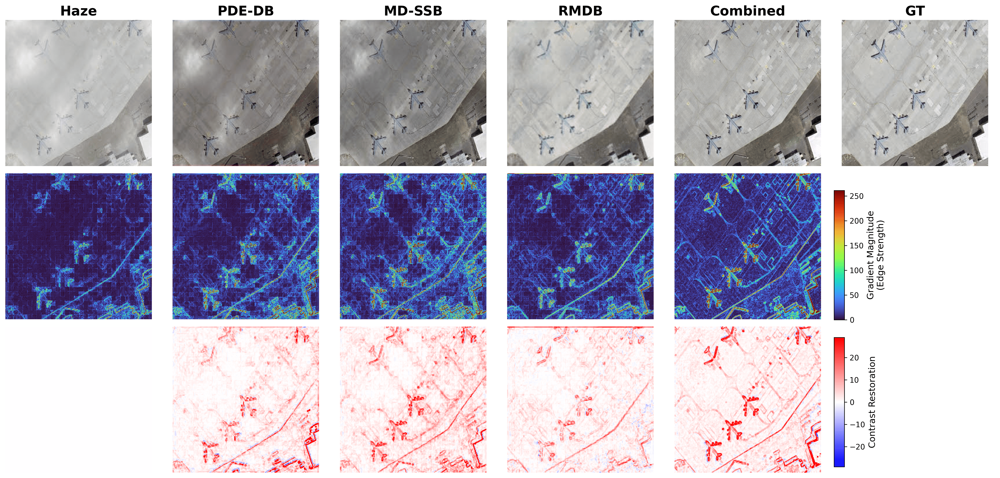
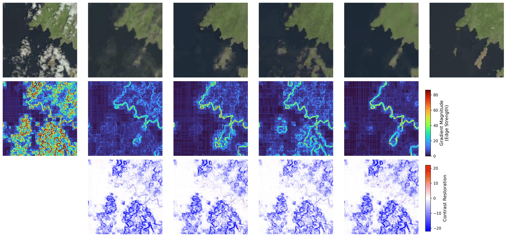
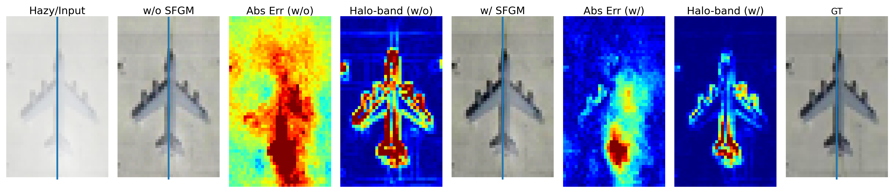

# DSCH-Net - IEEE Transactions on Geoscience and Remote Sensing (TGRS)

Implementation of the paper [DSCH-Net: Diffusion-State-Contextual Hybrid Network for Physics-Inspired and Direction-Aware Dehazing of Remote Sensing Imagery](https://ieeexplore.ieee.org/document/11184784/), published in IEEE Transactions on Geoscience and Remote Sensing (TGRS).

Atmospheric haze degrades remote sensing images by reducing contrast, distorting colors, and obscuring fine details, which negatively impacts downstream tasks. DSCH-Net is proposed to address these challenges by employing a physics-inspired, direction-aware deep learning framework for single-image dehazing.

The model integrates a PDE-based diffusion block to suppress haze while preserving structural edges. A multi-directional state-space module efficiently captures long-range spatial dependencies with linear complexity.
Additionally, a multi-dilation residual block enhances fine textures and small structures. A selective fusion gating mechanism stabilizes feature fusion and reduces halo artifacts. The architecture follows an encoder–decoder design for effective feature learning and reconstruction.

Extensive experiments demonstrate strong performance across multiple remote sensing datasets. DSCH-Net achieves up to 32.20 dB PSNR and 0.980 SSIM, outperforming existing methods. Overall, it provides an efficient, robust, and scalable solution for real-world remote sensing dehazing applications.

## Model Architecture

<p align="center">
  
</p>

# Coding Hierarchy
```bash
DSCH-Net/
│── README.md  
│── requirements.txt
│── Dataset/
│   ├── RSID
│   ├── RICE1/2
│   ├── Haze1K
│   ├── DHID
│── Pre_trained/
│   ├── Model
│── Output
│   ├── dehazed_images
│── Train.py
│── Test.py
│── Arguments.py
│── Data_utils.py
│── Metrices.py
│── Loss.py
│── DSCH_Net.py
│── LICENSE
│── CITATION.cff  # Citation info
```


# Environment and Dependencies
```bash
# create a new environment
conda create -n dsch-net python=3.10

# activate environment
conda activate dsch-net

# install dependencies
pip install -r requirements.txt
```

## Dataset

The proposed model is trained and evaluated on multiple publicly available remote-sensing image-dehazing datasets. Please download the datasets from the official sources provided below.

### Remote Sensing Image Dehazing Dataset (RSID)
- Repository: https://github.com/chi-kaichen/Trinity-Net  
- Description: A widely used dataset for remote sensing image dehazing, containing paired hazy and clear images.

---

### Remote Sensing Image Cloud Removing Dataset (RICE)
- Repository: https://github.com/BUPTLdy/RICE_DATASET  
- Description: A cloud removal dataset designed for remote sensing applications with paired cloudy and cloud-free images.

---

### SateHaze1K
- Link: https://www.kaggle.com/datasets/mohit3430/haze1k  
- Description: A large-scale dataset for haze removal, including various haze density levels.

---

### DHID (Dense Haze Image Dataset)
- Repository: https://github.com/Shan-rs/DCI-Net  
- Description: A dataset focused on dense haze conditions for challenging dehazing scenarios.

---


# Test
```bash
python test.py 
```
# Train
```bash
python train.py 
```

## Results

<p align="center">
  
  
  
  
  
</p>


# Citation
If you find this work useful, please cite the paper:
```bash
@ARTICLE{11488354,
  author={Sultan, Naveed and Hayat, Mansoor and Prom-on, Santitham},
  journal={IEEE Transactions on Geoscience and Remote Sensing}, 
  title={DSCH-Net: Diffusion-State-Contextual Hybrid Network for Physics-Inspired and Direction-Aware Dehazing of Remote Sensing Imagery}, 
  year={2026},
  volume={},
  number={},
  pages={1-1},
  keywords={Earth Observing System;Sentinel-2;Satellite images;Landsat;Feeds;Broadcasting;Radio broadcasting;Broadcast technology;Frequency modulation;Filters;Single-image dehazing;physics-guided restoration;state-space modeling;diffusion prior;global context},
  doi={10.1109/TGRS.2026.3685508}}
```

# Acknowledgement
This code is built on [SFRDP-Net](https://github.com/789as-syl/SFRDP-Net), [MABDT](https://github.com/ningjin00/MABDT), [DS-RDMPD](https://github.com/Aaronwangz/DS-RDMPD) and [DA-Net](https://github.com/namwonss/DA-Net).  We are very grateful for this excellent work. Their contributions laid the foundation for our advancements this field. We are also thankful to King Mongkut's University of Technology Thonburi for funding support for the fiscal year 2025-2026.
